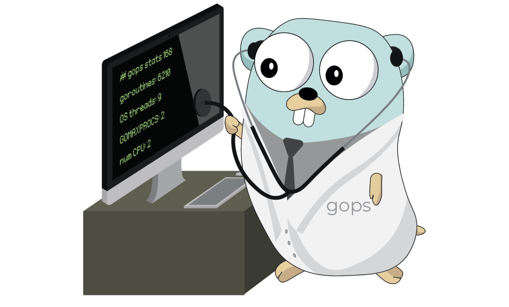
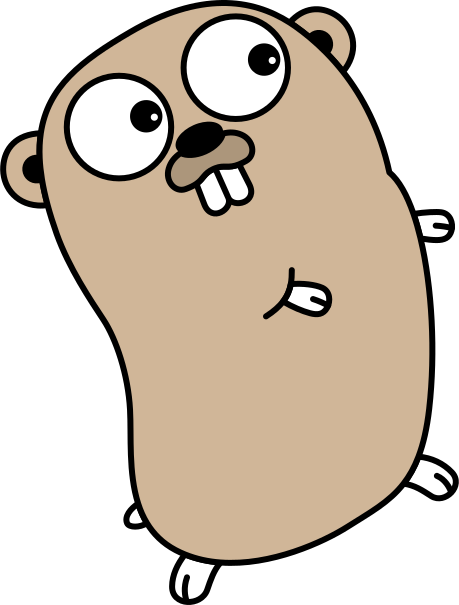

## В данном репозитории собраны минипроекты для иллюстрации проделанных работ, а также просто интересные решения. 

 

 
  
### 1. calculator  
    - примитивный калькулятор с использованием мапы и анонимных функций как задатчика операций. 
    Показалась интересной идея представления калькулятора в виде map, а не банальным switch-case.   
  
### 2. primeForStepik-battery  
    - пример к курсу на Stepik о том как могут работать интерфейсы.  
    Данная программа написана под влиянием задачи на образовательной платформе Stepik.  
    Задача называлась "Батарейка" и сводилась к показу уровня заряда батареи, например телефона,  
    в виде [    XXXXXX] в зависимости от сигналов от секций аккумулятора.  
    Цель написания: наглядно показать обучающимся как устроены интерфейсы.  
  
### 3. consoleToDoList  
    - консольная версия планировщика задач с вынесеной базой данных.  
    Программа позволяет создавать и вести базу задач, поддерживает CRUD операции и поисковые запросы, 
    позволяет удалять всю базу целиком, а также поддерживает удобные короткие команды. 
    Инструкции по запуску и подробное описание читайте в файле main.go.  
  
### 4. currencyConverter  
    - конвертер валют по актуальному курсу ЦБ РФ.  
    Консольный конвертер валют с онлайн обновлением курса через внешний ресурс.  
    При запуске программы не забудьте обеспечить связь с сетью.  
    Более подробное описание читайте в файле main.go.  
  
### 5. comparatorInSort  
    - иллюстрация передачи функции компаратора в функцию сортировщик.  
    Программа представляет собой сортирвщик слайса строк:  
	- в лексикографическом порядке  
	- по длине строк  
	- по первому символу  
	- по последнему символу  
	- по количеству цифр.  
	Программа служит иллюстрацией передачи функции компаратора в функцию сортировщик.  
  
### 6. goroutinsCounter  
    - пример многопоточного программирования  

    

